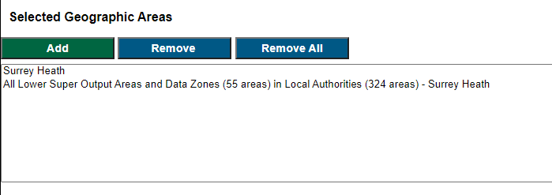
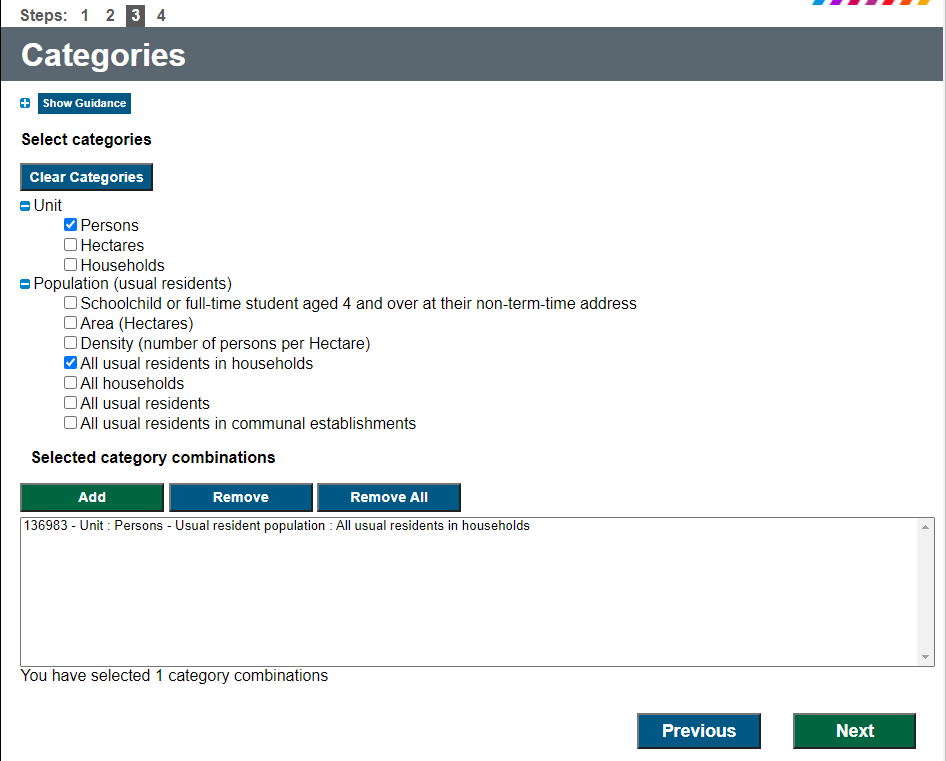

This document provides some extra information on how to download the datsets required for the project. 

All data can be found via git *link*


```{r load packages, echo = TRUE, include=FALSE}
# for data reading/manipulation 
library(dplyr)
library(tidyr)
library(readr)
library(tibble)
library(janitor)
# for spatial data and gis
library(sf)
library(ggplot2)
library(ggspatial)
library(spdep)
library(leaflet) 
library(RColorBrewer)
library(tmap)
```


### Crime Data 

Follow the link https://data.police.uk/

- Select 'Downloads' 
- In date range select 'January 2019 to December 2019'
- Select 'Surrey Police' and 
- select 'Include Crime Data'. 
- Download and unzip the data into your working directory

We will be using just the 08/2020 reported crimes rep. 
 

```{r, echo = TRUE, include=TRUE}
crime01_19 <- read_csv("Data/2020-08/2020-08-surrey-street.csv") %>% 
  janitor::clean_names() 

```


\newpage


## Shapefle 

To optain boundary data we will use the  https://borders.ukdataservice.ac.uk/bds.html 

Steps to download: 

- Select; England, Statistical Building Block, 2011 and later
- Click 'Find' 
- Select 'English Lower Layer Super Output Areas' 
- Click 'List Areas' 
- Select 'Surrey Health' 
- Click 'Extract Boundary Data' 


Read in the Shapefile for 'Surrey Heath' 

```{r, echo = TRUE, include=TRUE}
shp_file <- st_read("Data/Shapefile/england_lsoa_2011.shp")

```


\newpage 


## Census Data

To obatin population statistics use http://infuse2011gf.ukdataservice.ac.uk/


- Select 'Geography' 
- Expand the 'Local Authorities' tab in England
- Tick and expand 'Surrey Heath'
- Select 'Lower Super Output area and Data Zones (55 areas)'
- Select 'Add' and 'Next'

```{r, echo=FALSE, out.width = '100%'}
image <-  
image
```

- Click 'Population (usual residence)'
- Click Next 
- Under unit select 'Persons' and under 'Population (usual residents)' select 'All usual residets in households' 
- Click 'Add' 

```{r, echo=FALSE, out.width = '100%'}
image <-  
image
```

- Click 'Next and download the data


To read in the data 

```{r, echo = TRUE, include= TRUE}
pop <- read_csv("Data/Census Population/Data_UNIT_URESPOP.csv") %>% 
  slice(3:47) %>%                             #removes first and second row
  select(2,3,6,7) %>%                         #selects the columns of interest
  janitor::clean_names() %>%                  #cleans the names 
  rename(pop_count = f136983) %>%             #rename the variable
  mutate(pop_count = as.numeric(pop_count))   #turns variable to numeric 

```


