```{r setup, include=FALSE}
knitr::opts_chunk$set(echo = FALSE)
```

## Welcome

```{r, echo=FALSE, out.width="150px"}
knitr::include_graphics("https://pbs.twimg.com/profile_images/866718054989930496/1JnqmEAe_400x400.jpg")
```

@sh_langton

s.langton@leeds.ac.uk

www.samlangton.info

---

## Welcome

```{r, echo=FALSE, out.width="150px"}
knitr::include_graphics("https://pbs.twimg.com/profile_images/866718054989930496/1JnqmEAe_400x400.jpg")
```

@sh_langton

s.langton@leeds.ac.uk

www.samlangton.info

<br>

All materials for today are available online.

Web link: https://rpubs.com/langton_

Material: https://github.com/langtonhugh/data_viz_R_workshop

</br>


---

## Contents

**10.00-10.15**

- Intro

**10.15-11.00**

- Presentation: data visualisation

**11.00-11.15**

- Short break

**11.15-13.00**

Practical

**13.00-14.00**

- Long break

**14.00-14.30**

- Presentation: applied research using data visualisation

---

## Data viz

<center>

"The visual representation and presentation of data to facilitate understanding" (Kirk, 2019)

</center>

---

## Data viz in R

<center>

"The visual representation and presentation of data to facilitate understanding" (Kirk, 2019)

</center>

```{r, echo=FALSE, out.width="600px", fig.align="center"}
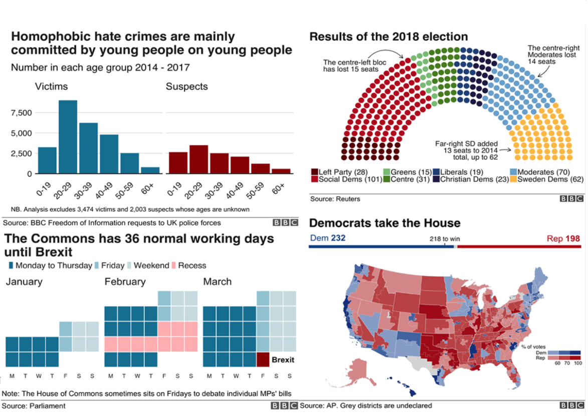
```

Source: [Medium](https://medium.com/bbc-visual-and-data-journalism/how-the-bbc-visual-and-data-journalism-team-works-with-graphics-in-r-ed0b35693535)

---

## Data viz in R

```{r, echo=FALSE, out.width="650px", fig.align= "center"}
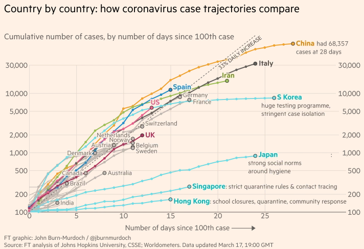
```

Source: [John Burn-Murdoch](https://twitter.com/jburnmurdoch)

---


## Data viz in R

```{r, echo=FALSE, out.width="700px", fig.align= "center"}
knitr::include_graphics("img/colin_angus1.png")
```

Source: [Colin Angus](https://twitter.com/VictimOfMaths/status/1254812636744687619/photo/3)

---


## Data viz in R

```{r, echo=FALSE, out.width="1000px", fig.align= "center"}
knitr::include_graphics("img/colin_angus2.png")
```

Source: [Colin Angus](https://twitter.com/VictimOfMaths/status/1254812636744687619/photo/1)


---

## Data viz in R

```{r, echo=FALSE}
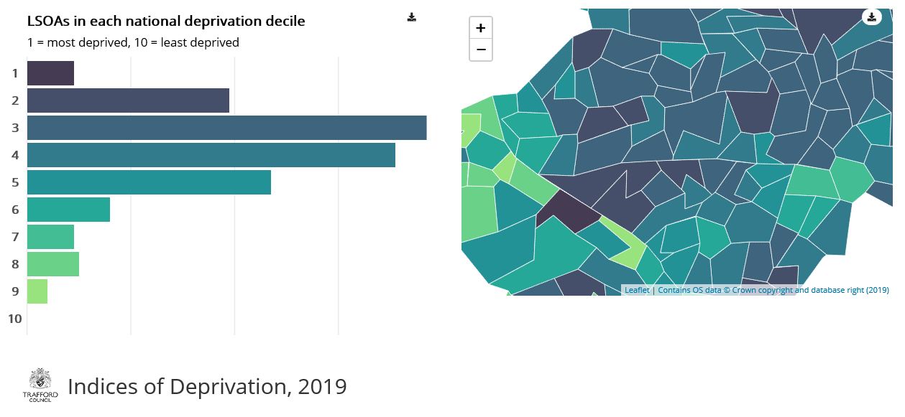
```

Source: [Trafford Data Lab](https://trafforddatalab.shinyapps.io/imd19/)

---

## Data viz in R

```{r, echo=FALSE, out.width="250px", fig.align= "center"}
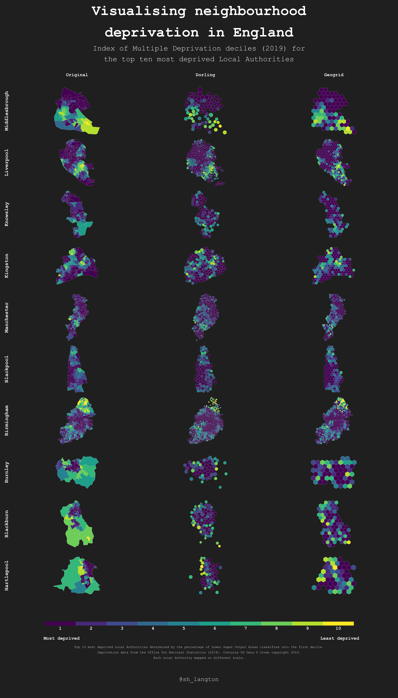
```

Source: [Sam Langton](https://github.com/langtonhugh/spatial_viz)

---

## Data viz in R

```{r, echo=FALSE, out.width="400px", fig.align= "center"}
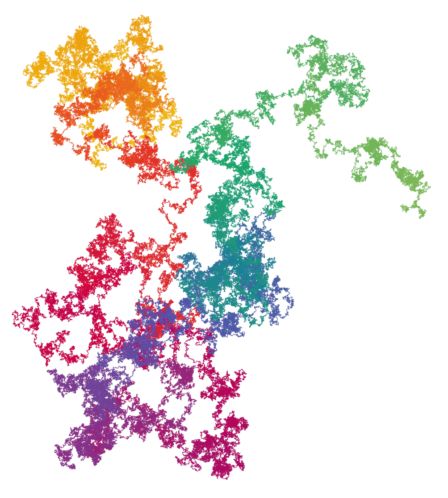
```

Source: [Nadleh Bremer](https://www.visualcinnamon.com/2015/01/exploring-art-hidden-in-pi.html)

---

## Data viz in R using crime data

```{r, echo=FALSE,  out.width="600px", fig.align= "center"}
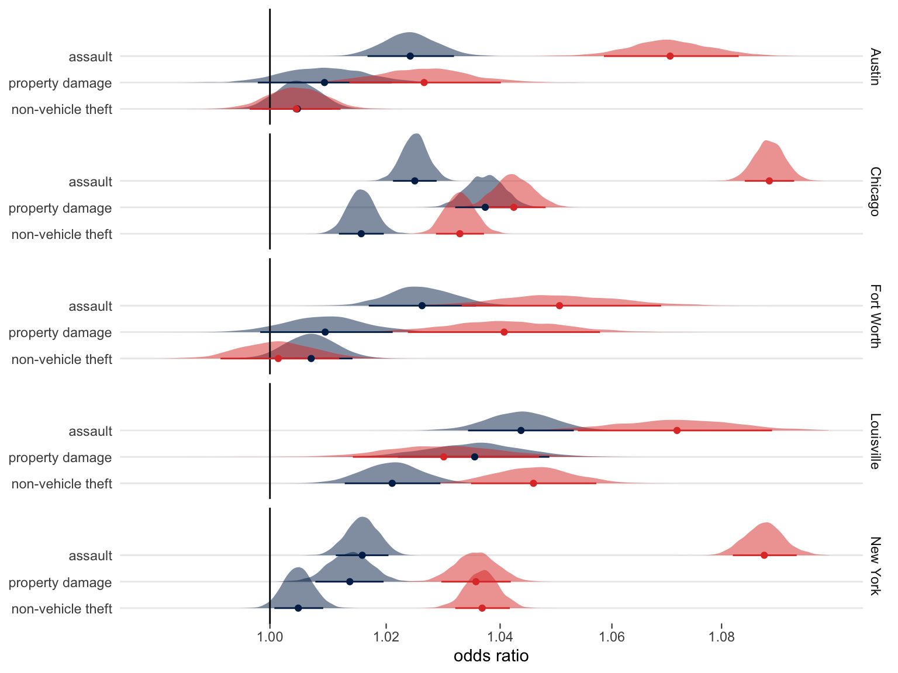
```

Source: [Matt Ashby](http://lesscrime.info/slides/esc-2019.html#/section-2)

---

## Data viz in R using crime data

```{r, echo=FALSE,  out.width="400px", fig.align= "center"}
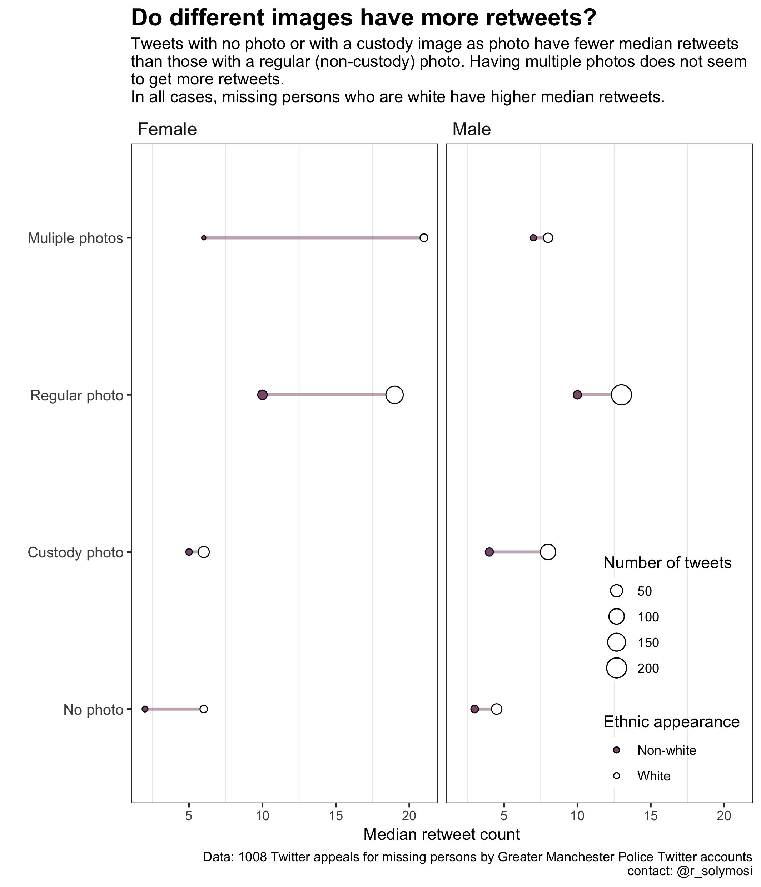
```

Source: [Reka Solymosi](https://twitter.com/r_solymosi/status/1169565465355726848)

---

## Data viz in R using crime data

```{r, echo=FALSE,  out.width="450px", fig.align= "center"}
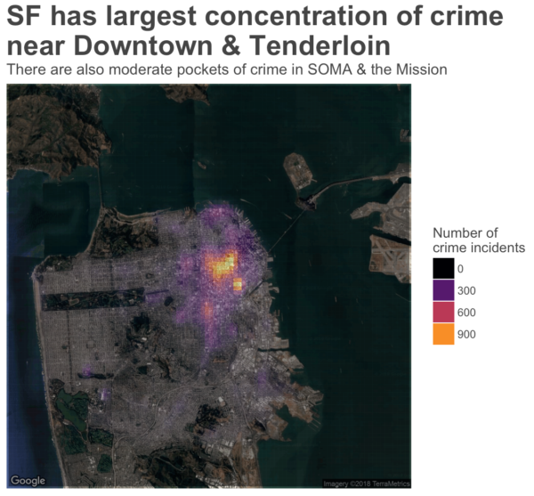
```

Source: [Sharp Insight](https://www.sharpsightlabs.com/blog/how-to-create-a-crime-heatmap-in-r/)


---

## Data viz in R using crime data

```{r, echo=FALSE,  out.width="600px", fig.align= "center"}
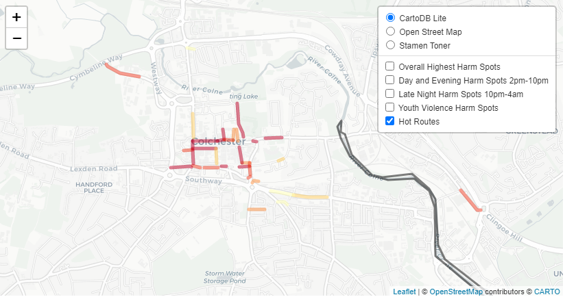
```

Source: [Iain Agar](https://twitter.com/routineactivity)

---

## Data viz in R using crime data

```{r, echo=FALSE, fig.align= "center"}
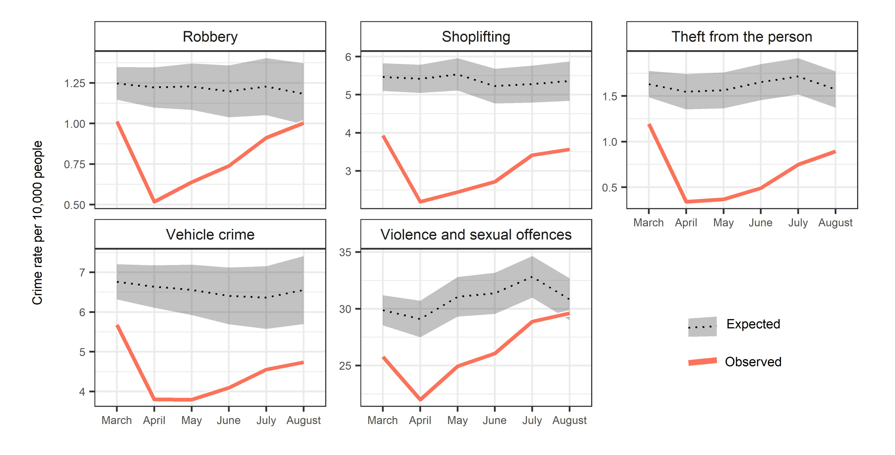
```

Source: [Langton, Dixon and Farrell (2020)](https://osf.io/preprints/socarxiv/t7ne8/)

---

## Common thread?

---

## Common thread?

```{r, echo=FALSE,  out.width="380px", fig.align= "center"}
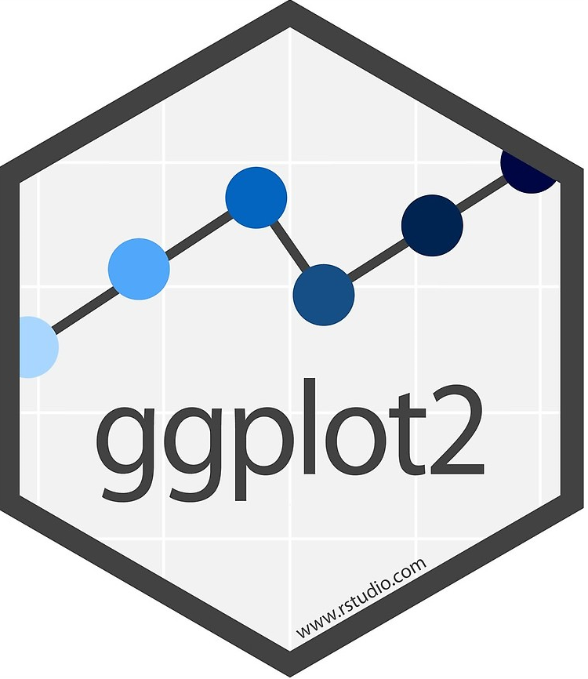
```

---

## ggplot2

- ggplot2 is a package for creating graphics in R based on the [grammar of graphics](https://vita.had.co.nz/papers/layered-grammar.html).
- A fundamental component of this is that graphics are made up **layers**.
- This way of thinking is reflected in how we write ggplot2 code.

<br>

<br>

```{r, echo=FALSE, out.width="380px", fig.align= "center"}
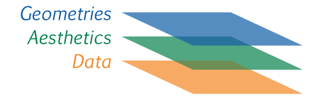
```

Image source: [Skill Gaze](https://skillgaze.com/2017/10/31/understanding-different-visualization-layers-of-ggplot/)

---

## ggplot2

```{r, echo=F, warning=F, message=F, results=F}

library(ggplot2);library(kableExtra)

df1 <- data.frame(var1 = c(5, 3, 7, 9, 12),
                  var2 = c(7, 2, 9, 15, 17),
                  var3 = c("AA","AA","AA", "BB","BB"))

df2 <- data.frame(x = c(5, 3, 7, 9, 12),
                  y = c(7, 2, 9, 15, 17),
                  var = c("AA","AA","AA", "BB","BB"))

df3 <- data.frame(x = c(5, 3, 7, 9, 12),
                  y = c(7, 2, 9, 15, 17),
                  shape = c("AA","AA","AA", "BB","BB"))

df4 <- data.frame(x = c(5, 3, 7, 9, 12),
                  y = c(7, 2, 9, 15, 17),
                  colour = c("AA","AA","AA", "BB","BB"))
```

```{r}
kable(df1,align = "l", caption = "df1")
```

---

## ggplot2

```{r}
kable(df1,align = "l", caption = "df1")
```

<br>

<center>

What is the relationship between var1 and var2?

</center>

---

## ggplot2: data


<br>

<br>


```{r, echo=FALSE, out.width="380px", fig.align= "center"}

```

Image source: [Skill Gaze](https://skillgaze.com/2017/10/31/understanding-different-visualization-layers-of-ggplot/)

---

## ggplot2: data

```{r, echo = T, results = F, eval=F}
ggplot(data = df1)
```

.pull-left[
```{r, echo = F, out.width="320px"}
ggplot(data = df1)
```
]

<br> 

.pull-right[
```{r}
kable(df1,align = "l", caption = "df1")
```
]

---

## ggplot2: aesthetics

<br>

<br>

```{r, echo=FALSE, out.width="380px", fig.align= "center"}

```

Image source: [Skill Gaze](https://skillgaze.com/2017/10/31/understanding-different-visualization-layers-of-ggplot/)


---

## ggplot2: aesthetics

```{r, echo = T, results = F, eval=F}
ggplot(data = df1, mapping = aes(x = var1, y = var2))
```

.pull-left[
```{r, echo = F, out.width="400px"}
ggplot(data = df1, mapping = aes(x = var1, y = var2)) +
    theme(axis.title = element_text(size = 20),
        axis.text = element_text(size = 20))
```
]

<br> 

.pull-right[
```{r}
kable(df1,align = "l", caption = "df1")
```
]

---

## ggplot2: geometries

<br>

<br>


```{r, echo=FALSE, out.width="380px", fig.align= "center"}

```

Image source: [Skill Gaze](https://skillgaze.com/2017/10/31/understanding-different-visualization-layers-of-ggplot/)


---

## ggplot2: geometries

```{r, echo = T, results = F, eval=F}
ggplot(data = df1, mapping = aes(x = var1, y = var2)) +
  geom_point()
```

.pull-left[
```{r, echo = F, out.width="400px"}
ggplot(data = df1, mapping = aes(x = var1, y = var2)) +
  geom_point(size = 5) +
  theme(axis.title = element_text(size = 20),
        axis.text = element_text(size = 20))
```
]

<br> 

.pull-right[
```{r}
kable(df1,align = "l", caption = "df1")
```
]

---

## ggplot2: different aesthetics

```{r}
kable(df1,align = "l", caption = "df1")
```

<br>

<center>

How does var3 factor into this relationship?

</center>


---

## ggplot2: different aesthetics

- x
- y
- colour
- fill
- shape
- size
- alpha
- linetype
- ...

---


## ggplot2: different aesthetics

```{r, echo = T, results = F, eval=F}
ggplot(data = df1, mapping = aes(x = var1, y = var2, colour = var3)) +
  geom_point()
```

.pull-left[
```{r, echo = F, out.width="400px"}
ggplot(data = df1, mapping = aes(x = var1, y = var2, colour = var3)) +
  geom_point(size = 5) +
  theme(axis.title = element_text(size = 20),
        axis.text = element_text(size = 20))
```
]

<br> 

.pull-right[
```{r}
kable(df1,align = "l", caption = "df1")
```
]

---

## ggplot2: different aesthetics

```{r, echo = T, results = F, eval=F}
ggplot(data = df1, mapping = aes(x = var1, y = var2, shape = var3)) +
  geom_point()
```

.pull-left[
```{r, echo = F, out.width="400px"}
ggplot(data = df1, mapping = aes(x = var1, y = var2, shape = var3)) +
  geom_point(size = 5) +
  theme(axis.title = element_text(size = 20),
        axis.text = element_text(size = 20))
```
]

<br> 

.pull-right[
```{r}
kable(df1,align = "l", caption = "df1")
```
]

---

## ggplot2: different geometries

- geom_point()
- geom_bar()
- geom_density()
- geom_smooth()
- ...

```{r, echo=FALSE, fig.align= "center"}
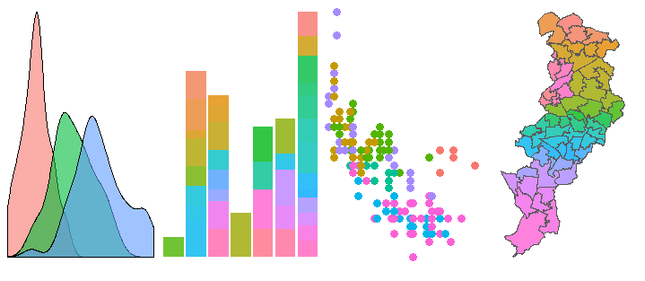
```

---

## Crime demo
